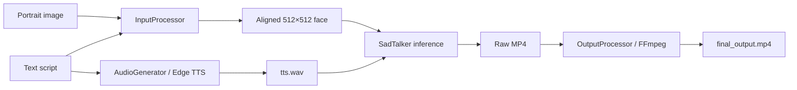

# LiveTalk AI — Talking Head Video Generator

Generate realistic talking-head videos from a **single portrait image** and a **text script**. The pipeline detects and aligns the face, converts text to speech, animates the face with [SadTalker](https://github.com/OpenTalker/SadTalker), and exports a web-ready MP4.

**Repository:** [github.com/ChiragPatankar/Live-Talk-AI](https://github.com/ChiragPatankar/Live-Talk-AI)

---

## Table of contents

1. [Features](#features)
2. [How it works](#how-it-works)
3. [Requirements](#requirements)
4. [Quick start](#quick-start)
5. [Detailed setup](#detailed-setup)
6. [Downloading models](#downloading-models)
7. [Running the app](#running-the-app)
8. [Command-line usage](#command-line-usage)
9. [Project structure](#project-structure)
10. [Configuration](#configuration)
11. [Tips for best results](#tips-for-best-results)
12. [Troubleshooting](#troubleshooting)
13. [What is not in this repo](#what-is-not-in-this-repo)
14. [Credits & license](#credits--license)

---

## Features

| Feature | Description |
|--------|-------------|
| **Face detection & alignment** | Uses dlib to find the face, crop with margin, and resize to 512×512 |
| **Text-to-speech** | [Microsoft Edge TTS](https://github.com/rany2/edge-tts) (`edge-tts`) — no API key required |
| **Talking-head animation** | SadTalker with GFPGAN face enhancement |
| **Web UI** | Streamlit app: upload image, type or upload script, download video |
| **CLI** | `main.py` for batch or scripted runs |

---

## How it works



1. **Input processing** — Detect face with dlib, align and crop to 512×512.
2. **Audio generation** — Convert script to WAV via Edge TTS.
3. **Video animation** — Run SadTalker `inference.py` on the aligned image + audio.
4. **Output processing** — Re-encode with FFmpeg (H.264 + AAC, fast-start for web).

---

## Requirements

### Hardware

| Component | Minimum | Recommended |
|-----------|---------|-------------|
| **RAM** | 8 GB | 16 GB+ |
| **GPU** | Optional (CPU works, slower) | NVIDIA GPU with CUDA for SadTalker |
| **Disk** | ~6 GB free | ~10 GB (models + venv) |

### Software

| Tool | Version | Notes |
|------|---------|--------|
| **Python** | 3.8 – 3.10 | 3.10 tested on Windows; avoid 3.12+ with some deps |
| **Git** | Any recent | To clone this repo |
| **FFmpeg** | Recent | **Required** — must be on `PATH` (see [FFmpeg on Windows](#ffmpeg-on-windows)) |
| **CMake** | 3.x | Often needed to build **dlib** on Windows |
| **Visual Studio Build Tools** | 2019+ | C++ workload — needed for dlib on Windows |

### Network

- Internet access for **pip installs**, **Edge TTS**, and **model downloads** (~2–4 GB for SadTalker checkpoints).

---

## Quick start

From the project root (`d:\3D` or your clone path):

```powershell
# 1. Clone (if you haven't already)
git clone https://github.com/ChiragPatankar/Live-Talk-AI.git
cd Live-Talk-AI

# 2. Create and activate virtual environment
python -m venv .venv
.\.venv\Scripts\activate

# 3. Install Python dependencies
pip install --upgrade pip
pip install -r requirements.txt
pip install -r SadTalker\requirements.txt

# 4. Download models (see sections below)
#    - dlib shape predictor → project root
#    - SadTalker checkpoints → SadTalker\checkpoints and SadTalker\gfpgan

# 5. Start the Streamlit app
streamlit run app.py
```

Open the URL shown in the terminal (usually `http://localhost:8501`).

---

## Detailed setup

### 1. Clone the repository

```powershell
git clone https://github.com/ChiragPatankar/Live-Talk-AI.git
cd Live-Talk-AI
```

The repo includes the **SadTalker source code** under `SadTalker/`. Model weights are **not** included (too large for GitHub); you download them once locally.

### 2. Create a virtual environment

Using a venv keeps dependencies isolated from your system Python.

```powershell
python -m venv .venv
.\.venv\Scripts\activate
```

You should see `(.venv)` in your prompt. To deactivate later: `deactivate`.

**Optional — save commands** (see `commands` in the repo):

```powershell
.\.venv\Scripts\activate
streamlit run app.py
```

### 3. Install PyTorch

Install PyTorch **before** or **with** other packages, matching your system:

- **CPU only:** [https://pytorch.org/get-started/locally/](https://pytorch.org/get-started/locally/)
- **CUDA (NVIDIA GPU):** Select the CUDA version that matches your driver.

Example (CPU):

```powershell
pip install torch torchvision torchaudio
```

### 4. Install project dependencies

```powershell
pip install --upgrade pip
pip install -r requirements.txt
pip install -r SadTalker\requirements.txt
```

| File | Purpose |
|------|---------|
| `requirements.txt` | LiveTalk AI: OpenCV, dlib, Streamlit, edge-tts, etc. |
| `SadTalker/requirements.txt` | SadTalker: face_alignment, gfpgan, basicsr, safetensors, etc. |

### 5. Install dlib (Windows)

`dlib` is used for face landmarks. On Windows it often must be compiled:

```powershell
pip install cmake
pip install dlib
```

If `pip install dlib` fails, install [Visual Studio Build Tools](https://visualstudio.microsoft.com/visual-cpp-build-tools/) with **“Desktop development with C++”**, then retry.

### 6. Install FFmpeg

FFmpeg is required by `OutputProcessor` and SadTalker.

#### FFmpeg on Windows

1. Download from [https://ffmpeg.org/download.html](https://ffmpeg.org/download.html) (e.g. gyan.dev builds), or install with [Scoop](https://scoop.sh): `scoop install ffmpeg`
2. Add the `bin` folder to your **PATH**
3. Verify:

```powershell
ffmpeg -version
ffprobe -version
```

---

## Downloading models

Large files are **gitignored**. After cloning, download them once.

### A. dlib shape predictor (~100 MB)

Used by `InputProcessor` for 68 facial landmarks.

| Item | Value |
|------|--------|
| **Download** | [shape_predictor_68_face_landmarks.dat.bz2](http://dlib.net/files/shape_predictor_68_face_landmarks.dat.bz2) |
| **Place at** | Project root: `shape_predictor_68_face_landmarks.dat` |

**Steps:**

1. Download the `.bz2` file from dlib.net.
2. Extract it (7-Zip, or Python):

```powershell
python -c "import bz2, shutil; shutil.copyfileobj(bz2.open('shape_predictor_68_face_landmarks.dat.bz2','rb'), open('shape_predictor_68_face_landmarks.dat','wb'))"
```

3. Confirm the file exists next to `app.py` and `main.py`.

Default path in code: `shape_predictor_68_face_landmarks.dat` (project root).

---

### B. SadTalker checkpoints & GFPGAN weights (~2–4 GB)

Used by `VideoAnimator` when running `SadTalker/inference.py`.

| Item | Location |
|------|----------|
| SadTalker checkpoints | `SadTalker/checkpoints/` |
| GFPGAN / facexlib weights | `SadTalker/gfpgan/weights/` |

#### Option 1 — PowerShell script (recommended on Windows)

```powershell
cd SadTalker
.\scripts\download_models.ps1
cd ..
```

This downloads:

- `checkpoints/mapping_00109-model.pth.tar`
- `checkpoints/mapping_00229-model.pth.tar`
- `checkpoints/SadTalker_V0.0.2_256.safetensors`
- `checkpoints/SadTalker_V0.0.2_512.safetensors`
- `gfpgan/weights/alignment_WFLW_4HG.pth`
- `gfpgan/weights/detection_Resnet50_Final.pth`
- `gfpgan/weights/GFPGANv1.4.pth`
- `gfpgan/weights/parsing_parsenet.pth`

You may see **“Writing request stream”** or progress output in the terminal while files download — that is normal.

#### Option 2 — Bash script (WSL / Linux / macOS)

```bash
cd SadTalker
bash scripts/download_models.sh
cd ..
```

#### Option 3 — Manual

See [SadTalker releases](https://github.com/OpenTalker/SadTalker/releases) and [SadTalker install docs](https://github.com/OpenTalker/SadTalker/blob/main/docs/install.md).

#### Verify SadTalker layout

After downloads, you should have:

```
SadTalker/
├── inference.py
├── checkpoints/
│   ├── mapping_00109-model.pth.tar
│   ├── mapping_00229-model.pth.tar
│   ├── SadTalker_V0.0.2_256.safetensors
│   └── SadTalker_V0.0.2_512.safetensors
└── gfpgan/
    └── weights/
        ├── alignment_WFLW_4HG.pth
        ├── detection_Resnet50_Final.pth
        ├── GFPGANv1.4.pth
        └── parsing_parsenet.pth
```

---

## Running the app

### Streamlit web UI

```powershell
.\.venv\Scripts\activate
streamlit run app.py
```

| Step | Action |
|------|--------|
| 1 | Upload a portrait (`.jpg`, `.jpeg`, `.png`) |
| 2 | Enter script text **or** upload a `.txt` file |
| 3 | (Optional) Adjust paths in the **sidebar** if models are not in default locations |
| 4 | Click **Generate Talking Head Video** |
| 5 | Wait (several minutes on CPU; faster on GPU) |
| 6 | Preview and download the result |

**Sidebar defaults:**

| Setting | Default |
|---------|---------|
| Shape predictor | `shape_predictor_68_face_landmarks.dat` |
| SadTalker directory | `SadTalker` |

---

## Command-line usage

```powershell
python main.py --image path\to\portrait.jpg --text path\to\script.txt --output output
```

### Arguments

| Argument | Required | Default | Description |
|----------|----------|---------|-------------|
| `--image` | Yes | — | Input portrait path |
| `--text` | Yes | — | Path to UTF-8 text script (`.txt`) |
| `--output` | No | `output` | Directory for aligned face, audio, and final video |
| `--shape_predictor` | No | `shape_predictor_68_face_landmarks.dat` | dlib landmarks file |
| `--sadtalker_dir` | No | `SadTalker` | Path to SadTalker folder |

### Example

```powershell
python main.py `
  --image samples\face.png `
  --text samples\script.txt `
  --output output `
  --shape_predictor shape_predictor_68_face_landmarks.dat `
  --sadtalker_dir SadTalker
```

**Outputs in `--output`:**

| File | Description |
|------|-------------|
| `aligned_face.png` | Cropped 512×512 face |
| `tts.wav` | Generated speech |
| `*.mp4` | SadTalker raw result |
| `final_output.mp4` | FFmpeg-processed final video |

---

## Project structure

```
Live-Talk-AI/
├── app.py                      # Streamlit UI
├── main.py                     # CLI entry point
├── requirements.txt            # LiveTalk AI dependencies
├── commands                      # Handy activate/run notes
├── shape_predictor_68_face_landmarks.dat   # YOU DOWNLOAD (not in git)
├── modules/
│   ├── input_processing.py     # dlib face detect + align, read script
│   ├── audio_generation.py     # Edge TTS → WAV
│   ├── video_animation.py      # SadTalker subprocess
│   └── output_processing.py    # FFmpeg finalize
└── SadTalker/                  # SadTalker source (from OpenTalker)
    ├── inference.py
    ├── requirements.txt
    ├── scripts/
    │   ├── download_models.ps1
    │   └── download_models.sh
    ├── checkpoints/            # YOU DOWNLOAD (not in git)
    └── gfpgan/weights/         # YOU DOWNLOAD (not in git)
```

---

## Configuration

### Text-to-speech voice

Default voice: `en-US-ChristopherNeural` (see `modules/audio_generation.py`).

To change it in code:

```python
audio_gen = AudioGenerator(voice="en-GB-SoniaNeural")
```

List voices (requires network):

```python
import asyncio
from modules.audio_generation import AudioGenerator
print(asyncio.run(AudioGenerator.get_available_voices()))
```

### SadTalker inference options

`VideoAnimator` calls SadTalker with:

- `--enhancer gfpgan`
- `--still`
- `--preprocess full`

To change behavior (expression scale, resolution, etc.), edit `modules/video_animation.py` and see [SadTalker inference options](https://github.com/OpenTalker/SadTalker).

---

## Tips for best results

| Topic | Recommendation |
|-------|----------------|
| **Image** | Clear, frontal face; good lighting; minimal occlusion |
| **Resolution** | At least 512×512 source; face should fill a good portion of the frame |
| **Script** | Plain UTF-8 text; moderate length (very long scripts = long TTS + render time) |
| **GPU** | Use CUDA-enabled PyTorch if you have an NVIDIA GPU |
| **First run** | SadTalker may download extra assets on first inference — allow extra time |

---

## Troubleshooting

### `No face detected in the image`

- Use a photo with a visible, forward-facing face.
- Try a higher-resolution image or less extreme crop.

### `SadTalker directory not found` / `inference.py not found`

- Clone or copy the full `SadTalker/` folder.
- Set sidebar or `--sadtalker_dir` to the correct path.

### `SadTalker failed` / missing checkpoint errors

- Run `SadTalker\scripts\download_models.ps1` and confirm files under `checkpoints/` and `gfpgan/weights/`.

### `FFmpeg not found`

- Install FFmpeg and add it to `PATH`; restart the terminal.

### `pip install dlib` fails on Windows

- Install Visual Studio Build Tools (C++), then `pip install cmake` and retry `pip install dlib`.

### Streamlit shows errors about shape predictor

- Download and extract `shape_predictor_68_face_landmarks.dat` to the project root (or set the sidebar path).

### Generation is very slow

- Expected on CPU. Install CUDA PyTorch and use a GPU if available.
- Shorter scripts reduce TTS and render time.

### Terminal shows `Writing request stream` during download

- Normal PowerShell/`Invoke-WebRequest` behavior while model files download. Wait until `Download complete!` appears.

### Port already in use (Streamlit)

```powershell
streamlit run app.py --server.port 8502
```

---

## What is not in this repo

These are excluded via `.gitignore` to keep the repository small:

| Excluded | Size (approx.) | How to get it |
|----------|----------------|---------------|
| `.venv/` | Varies | `python -m venv .venv` |
| `shape_predictor_68_face_landmarks.dat` | ~100 MB | [dlib download](http://dlib.net/files/shape_predictor_68_face_landmarks.dat.bz2) |
| `SadTalker/checkpoints/` | ~1–2 GB | `SadTalker/scripts/download_models.ps1` |
| `SadTalker/gfpgan/` weights | ~500 MB+ | Same script |
| `output/`, generated `*.mp4` | Varies | Created when you run the app |

---

## Credits & license

- **SadTalker:** [OpenTalker/SadTalker](https://github.com/OpenTalker/SadTalker) — see `SadTalker/LICENSE`
- **dlib shape predictor:** [dlib.net](http://dlib.net/)
- **TTS:** [edge-tts](https://github.com/rany2/edge-tts) (Microsoft Edge voices)
- **Face enhancement:** [GFPGAN](https://github.com/TencentARC/GFPGAN)

For implementation notes and architecture background, see `info.txt` in the repository.

---

## License

This project bundles SadTalker and related third-party code. Use and redistribution must comply with their respective licenses (see `SadTalker/LICENSE` and linked projects above).
